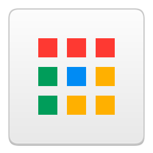

# App Launcher

  

> [!WARNING]
> This is unfinished! There are bugs and unadded features.

The long forgotten and discontinued feature, remade.

This version is based off of Chrome 48's App Launcher.

## Installation

Download the latest release from [Github Releases](https://github.com/weeniemount/applauncher/releases)

## Installation from source

1. Clone the repo using ``git clone https://github.com/weeniemount/applauncher``.
2. Navigate to the source ``cd applauncher``.
3. Run ``npm install`` and wait for the packages to install.
4. Run ``npm run dist`` and then run the newly made installer.

## Features
- Linux support
- Adding custom apps
- Dark mode
- Opening local programs
- Chromium, Canary and default app icons (only works when launching from exe, not shortcut)
- Opening sample CRX'es
